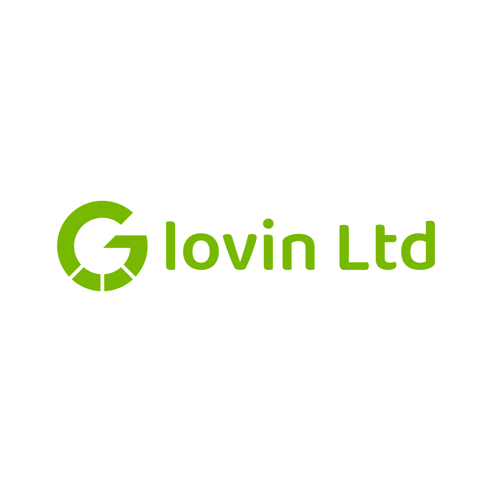

<p align="center">
  <a href="https://www.glovin.co.tz" target="_blank">
    
  </a>
</p>

<p align="center">
  <strong>Delivering secure, scalable, and intelligent digital solutions across Africa</strong>
</p>

<p align="center">
  <a href="https://www.glovin.co.tz"></a>
  <a href="https://www.glovin.co.tz/sitemap.xml"></a>
  
  
  
</p>

---

## [A] About Glovin Limited

Glovin Limited is a forward-thinking technology company dedicated to delivering **secure, scalable, and intelligent digital solutions** across Africa. With operational presence in both **Dubai** and **Dar es Salaam**, the company blends global innovation with strong regional expertise.

### [T] Our Mission
To provide timely, tailored, and high-quality solutions that protect client interests while addressing both technological and commercial challenges in a rapidly evolving digital landscape.

### [V] Our Vision
To become a leading African technology powerhouse by delivering innovative software and secure digital infrastructure that drive intelligent transformation across the continent.

---

## [S] Core Services & Solutions

### [1] Software Development
- Custom Enterprise Applications
- Web & Mobile Solutions
- API Development & Integration
- Cloud-Native Applications

### [2] Cybersecurity Solutions
- Security Operations Center (SOC)
- Threat Monitoring & Response
- Vulnerability Assessments
- Compliance & Risk Management

### [3] Healthcare Technology
- **HMIS** - Hospital Management Information Systems
- **EMR/EHR** - Electronic Medical Records
- Telemedicine Platforms
- Health Data Analytics

### [4] Financial Intelligence
- **CCIP** - Centralized Credit Intelligence Platform
- Digital Banking Solutions
- Payment Processing Systems
- Fraud Detection & Risk Management

### [5] Track & Trace Systems
- Anti-counterfeit Solutions
- Product Tracking Systems
- Supply Chain Visibility
- Regulatory Compliance Monitoring

---

## [I] Industries We Serve

| Industry | Solutions |
|----------|-----------|
| **[G]** **Government** | Revenue Collection, e-Government, Digital Services |
| **[H]** **Healthcare** | HMIS, EMR, Telemedicine, Health Analytics |
| **[B]** **Banking & Finance** | CCIP, Digital Banking, Payment Systems |
| **[T]** **Telecommunications** | Infrastructure, Billing Systems, Customer Management |
| **[M]** **Manufacturing** | ERP, Supply Chain, Quality Control |
| **[R]** **Retail** | POS, Inventory, E-commerce |
| **[E]** **Education** | Learning Management, Student Information Systems |
| **[L]** **Logistics** | Fleet Management, Route Optimization, Tracking |

---

## [T] Technology Stack

### Backend
- **Laravel 11** - PHP Framework
- **PHP 8.2+** - Modern PHP features
- **MySQL/PostgreSQL** - Database systems
- **Redis** - Caching & Session management

### Frontend
- **Tailwind CSS** - Utility-first CSS framework
- **Alpine.js** - Lightweight JavaScript framework
- **RemixIcon & Bootstrap Icons** - Icon libraries
- **AOS** - Animate On Scroll library

### DevOps & Tools
- **Git** - Version control
- **Composer** - PHP dependency manager
- **NPM** - Node package manager
- **Apache/Nginx** - Web servers

---

## [P] Project Structure

```
lovin/
├── app/                    # Application logic
│   ├── Http/              # Controllers & Middleware
│   ├── Models/            # Eloquent models
│   └── Providers/         # Service providers
├── config/                # Configuration files
├── database/              # Migrations & seeders
├── public/                # Public assets
│   ├── illustration/     # Section images
│   ├── logo/             # Company logos
│   └── transparentslogo/ # Transparent logos
├── resources/             # Views & assets
│   ├── views/            # Blade templates
│   │   ├── landing/     # Landing page sections
│   │   └── pages/       # Individual pages
│   ├── css/            # Stylesheets
│   └── js/             # JavaScript files
├── routes/                # Application routes
├── storage/               # Logs & cached files
├── tests/                 # Test suites
├── .env.example          # Environment template
├── .htaccess             # Root redirect rules
├── composer.json         # PHP dependencies
└── README.md             # This file
```

---

## [D] Getting Started

### Prerequisites
- PHP 8.2 or higher
- Composer
- MySQL/PostgreSQL
- Node.js & NPM (optional, for asset building)

### Installation

1. **Clone the repository**
   ```bash
   git clone https://github.com/yourusername/lovin.git
   cd lovin
   ```

2. **Install PHP dependencies**
   ```bash
   composer install
   ```

3. **Copy environment file**
   ```bash
   cp .env.example .env
   ```

4. **Generate application key**
   ```bash
   php artisan key:generate
   ```

5. **Configure database**
   Edit `.env` file and set your database credentials:
   ```env
   DB_DATABASE=lovin
   DB_USERNAME=root
   DB_PASSWORD=your_password
   ```

6. **Run migrations**
   ```bash
   php artisan migrate
   ```

7. **Seed database (optional)**
   ```bash
   php artisan db:seed
   ```

8. **Start development server**
   ```bash
   php artisan serve
   ```

Visit `http://localhost:8000` to see the application.

---

## [Y] Deployment

### Production Setup

1. **Upload files** to your web server
2. **Point domain** to the `public` folder (or use root `.htaccess` redirect)
3. **Set proper permissions**:
   ```bash
   chmod -R 755 storage
   chmod -R 755 bootstrap/cache
   ```
4. **Optimize for production**:
   ```bash
   php artisan config:cache
   php artisan route:cache
   php artisan view:cache
   ```

### Server Requirements
- Apache 2.4+ or Nginx 1.18+
- PHP 8.2+ with extensions: BCMath, Ctype, JSON, Mbstring, OpenSSL, PDO, Tokenizer, XML
- MySQL 8.0+ or PostgreSQL 13+
- SSL Certificate (recommended)

---

## [O] SEO & Performance

### Implemented Features
- [x] **XML Sitemap** - `/sitemap.xml`
- [x] **Meta Tags** - Open Graph, Twitter Cards
- [x] **Structured Data** - Schema.org markup
- [x] **Responsive Design** - Mobile-first approach
- [x] **Fast Loading** - Optimized images & CDN assets
- [x] **Clean URLs** - SEO-friendly routing

### Page Speed Optimizations
- CDN-hosted assets (Tailwind, Fonts, Icons)
- Optimized images with lazy loading
- Gzip compression enabled
- Browser caching configured

---

## [C] Contact Information

| Channel | Details |
|---------|---------|
| **Website** | [www.glovin.co.tz](https://www.glovin.co.tz) |
| **Email** | info@glovin.co.tz |
| **Phone** | +255 718 637 328 |
| **Head Office** | Dar es Salaam, Tanzania |
| **Regional Office** | Dubai, UAE |

### Business Hours
- **Monday - Friday**: 8:00 AM - 6:00 PM EAT
- **Support**: 24/7 Available

---

## Developer Information

**Developed by:** Ezra Daniel Gyunda

**License Status:** This software is developed under a commercial agreement. Full ownership and license rights will be transferred to Glovin Limited upon completion of payment as per the development contract.

---

## License

**Copyright (c) 2024-2026 Glovin Limited**

This project is proprietary software. All rights reserved.

Unauthorized copying, modification, distribution, or use of this software is strictly prohibited without express written permission from Glovin Limited and the developer Ezra Daniel Gyunda.

For licensing inquiries, please contact:
- Glovin Limited: info@glovin.co.tz
- Developer: [Developer Contact]

---

<p align="center">
  <strong>Transforming Africa Through Technology</strong><br>
  Secure | Scalable | Intelligent
</p>

<p align="center">
  
</p>
